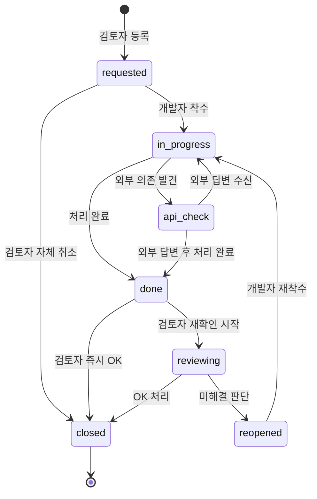

# 04. 워크플로우와 상태 관리

## 4.1 상태 정의

| 상태 | 코드 | 의미 |
|---|---|---|
| 요청됨 | `requested` | 검토자가 막 등록한 상태. 아무도 처리 시작 안 함 |
| 확인중 | `in_progress` | 개발자가 작업 시작 |
| API대기 | `api_check` | 외부 API 개발사에 문의 중 (외부 의존) |
| 완료 | `done` | 개발자가 처리 끝났다고 표시 |
| 검토중 | `reviewing` | 검토자가 실제로 동작 확인 중 |
| 검토완료 | `closed` | 검토자 OK, 클로즈 (terminal) |
| 재요청 | `reopened` | 검토자가 확인 시 미해결 판단, 다시 개발자에게 |

## 4.2 상태 다이어그램



## 4.3 권한 매트릭스

각 전이를 어떤 역할이 수행할 수 있는가:

| 전이 | 검토자 | 개발자 | 비고 |
|---|---|---|---|
| `(none)` → `requested` | O |  | 새 요청 등록 |
| `requested` → `in_progress` |  | O | 개발자가 착수 |
| `requested` → `closed` | O |  | 검토자가 자체 취소 |
| `in_progress` → `api_check` |  | O | 외부 의존 발견 |
| `in_progress` → `done` |  | O | 처리 완료 |
| `api_check` → `in_progress` |  | O | 외부 답변 받고 작업 재개 |
| `api_check` → `done` |  | O | 외부 답변 받고 처리 완료 |
| `done` → `reviewing` | O |  | 검토 시작 |
| `done` → `closed` | O |  | 즉시 OK |
| `reviewing` → `closed` | O |  | 확인 OK |
| `reviewing` → `reopened` | O |  | 미해결 판단 |
| `reopened` → `in_progress` |  | O | 재작업 착수 |
| 코멘트 작성 | O | O | 누구나 |
| 이미지 추가 | O | O | 등록 후에도 가능 |
| 검토 완료 (`reviewer_confirmed = true`) | O |  | `closed` 진입 시 자동 |

이 매트릭스는 `core/workflow.py`에 dict 형태로 코드화:

```python
# core/workflow.py
TRANSITIONS: dict[tuple[str, str], list[str]] = {
    # (current_status, role) -> [allowed_next_statuses]
    ("requested",   "developer"): ["in_progress"],
    ("requested",   "reviewer"):  ["closed"],
    ("in_progress", "developer"): ["api_check", "done"],
    ("api_check",   "developer"): ["in_progress", "done"],
    ("done",        "reviewer"):  ["reviewing", "closed"],
    ("reviewing",   "reviewer"):  ["closed", "reopened"],
    ("reopened",    "developer"): ["in_progress"],
}

def allowed_transitions(current: str, role: str) -> list[str]:
    return TRANSITIONS.get((current, role), [])
```

UI에서 상태 변경 드롭다운은 이 함수의 결과만 노출 → 권한 없는 전이는 애초에 보이지 않음.

## 4.4 긴급도 정의 및 SLA

| 긴급도 | 의미 | 첫 응답 | 처리 완료 |
|---|---|---|---|
| 긴급 (high) | 운영 차단, 데이터 오류, 데모 직전 발견 | 2시간 | 1영업일 |
| 보통 (normal) | 기능 이상이나 우회 가능 | 1영업일 | 3영업일 |
| 낮음 (low) | 개선, 문의, 문구 수정 | 3영업일 | 협의 |

**"첫 응답"** = 개발자가 `requested` → `in_progress` 또는 코멘트 작성한 시점.
**"처리 완료"** = `done` 또는 `closed`에 도달한 시점.

SLA 임박/위반은 통계 페이지에 별도 섹션으로 표시.

## 4.5 알림 (로컬 호스팅 환경)

이메일/슬랙은 별도 인프라 필요 → 일단 **앱 내 알림**으로 한정:

1. **사이드바 카운트 배지** — "내 액션 큐: 3건" 항상 표시
2. **헤더 알림 영역** — 마지막 방문 이후 새로 발생한 이벤트 N건 표시
3. **자동 새로고침** — `streamlit-autorefresh`로 30~60초마다 카운트 갱신
4. **(옵션) 브라우저 Notification API** — 사용자 동의 시 데스크톱 알림. JS 한 줄로 가능하지만 Streamlit과의 통합이 까다로워 후순위.

이메일이 필요해지면 `core/notifications.py`에 어댑터 추가하는 형태로 확장.

## 4.6 사전 정의 필터 뷰 ("스마트 큐")

| 뷰 이름 | 정의 | 누구에게 |
|---|---|---|
| 내 액션 큐 (개발자) | `status ∈ {requested, reopened, api_check 답변옴}` AND (`assignee = me` OR `assignee = null`) | 개발자 |
| 내 액션 큐 (검토자) | `status ∈ {done}` AND `author = me` | 검토자 |
| 내가 등록한 미해결 | `author = me` AND `status ≠ closed` | 검토자 |
| 오늘 SLA 임박 | `urgency = high` AND `created_at ≤ now-2h` AND `status ∈ 활성` | 모두 |
| 외부 대기 중 | `status = api_check` (장기 추적) | 모두 |
| 최근 7일 클로즈 | `status = closed` AND `closed_at >= now-7d` | 회고용 |
| 보관함 | `archived = true` | 모두 |

요청 목록 페이지 상단에 칩(chip)으로 노출 → 클릭 시 해당 필터 즉시 적용.

## 4.7 워크플로우 자동화

코드는 단순하게 — 별도 백그라운드 워커 없이 페이지 진입 시 점검:

| 자동화 | 트리거 | 동작 |
|---|---|---|
| 자동 아카이브 | `closed`된 지 14일 경과 | `archived = true`로 플래그 (목록 기본 제외) |
| SLA 위반 표시 | 카드 렌더 시 매번 계산 | 빨간 테두리, 큐 상단 고정 |
| 장기 API 대기 알림 | `api_check` 5일 경과 | 카드에 경고 배지, 담당자 액션 큐에 표시 |
| 자동 재오픈 | `closed` 후 24시간 내 코멘트 달림 | `reviewing`으로 상태 자동 변경 (옵션) |

자동 아카이브 같은 일괄 처리는 앱 시작 시 한 번 또는 별도 스크립트로 실행.

## 4.8 코멘트 스레드 구조

**선택: 단순 시간순 리스트** (트리/답글 구조 X)

이유:
- 항목당 참여자가 보통 2~3명 (검토자 1, 개발자 1, 옵션으로 API팀 1)
- 결정 흐름이 시간순으로 읽혀야 "지금 무슨 상태인지" 파악 쉬움
- 답글 트리는 컨텍스트가 분산되고, 한 화면에 들어오는 정보량이 줄어듦

대신 다음 기능으로 보완:
- **인용 답장** — 특정 코멘트 우측 [↩] 버튼 → 인용문이 입력창에 prefix됨
- **시스템 이벤트 인라인** — 상태 변경, 첨부 추가도 같은 타임라인에 시스템 코멘트로 끼워 넣음 → "11:00 김OO 코멘트 → 11:05 시스템: 상태 완료로 변경 → 11:10 이OO 코멘트" 한 흐름으로 보임
- **(옵션) @멘션** — `@김OO` 입력 시 노란색 강조 (실제 알림은 후순위)

## 4.9 데이터 모델 (pydantic)

`core/models.py`:

```python
from datetime import datetime
from enum import Enum
from typing import Literal
from pydantic import BaseModel, Field

class Urgency(str, Enum):
    high = "high"
    normal = "normal"
    low = "low"

class Status(str, Enum):
    requested = "requested"
    in_progress = "in_progress"
    api_check = "api_check"
    done = "done"
    reviewing = "reviewing"
    reopened = "reopened"
    closed = "closed"

class Role(str, Enum):
    reviewer = "reviewer"
    developer = "developer"

class StatusEvent(BaseModel):
    status: Status
    at: datetime
    by: str  # 사용자 이름

class ImageRef(BaseModel):
    file: str
    thumb: str | None = None
    uploaded_at: datetime
    sha256: str
    size_bytes: int

class Comment(BaseModel):
    id: str
    at: datetime
    author: str
    role: Role | Literal["system"]
    body: str
    kind: Literal["comment", "system"] = "comment"

class Issue(BaseModel):
    schema_version: int = 1
    id: str
    title: str = Field(min_length=1, max_length=120)
    description: str
    urgency: Urgency
    status: Status = Status.requested
    author: str
    author_role: Role
    assignee: str | None = None
    created_at: datetime
    updated_at: datetime
    status_history: list[StatusEvent] = []
    images: list[ImageRef] = []
    reviewer_confirmed: bool = False
    reviewer_confirmed_at: datetime | None = None
    tags: list[str] = []
    archived: bool = False
```

코멘트는 별도 JSONL이라 `Issue`에는 포함 안 함. 상세 페이지에서만 따로 로드.
