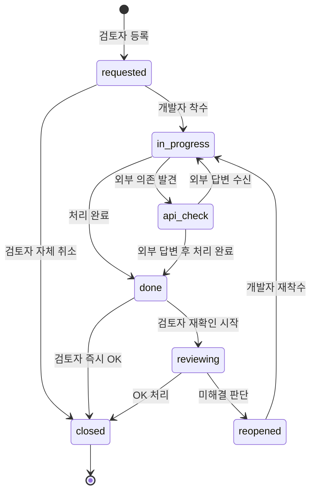

# 04. 워크플로우와 상태 관리

## 4.1 상태 정의

| 상태 | 코드 | 의미 |
|---|---|---|
| 요청됨 | `requested` | 검토자가 막 등록한 상태. 아무도 처리 시작 안 함 |
| 확인중 | `in_progress` | 개발자가 작업 시작 |
| API대기 | `api_check` | 외부 API 개발사에 문의 중 (외부 의존) |
| 완료 | `done` | 개발자가 처리 끝났다고 표시 |
| 검토중 | `reviewing` | 검토자가 실제로 동작 확인 중 |
| 검토완료 | `closed` | 검토자 OK, 클로즈 (terminal) |
| 재요청 | `reopened` | 검토자가 확인 시 미해결 판단, 다시 개발자에게 |

## 4.2 상태 다이어그램


```mermaid
stateDiagram-v2
    [*] --> requested: 검토자 등록
    requested --> in_progress: 개발자 착수
    requested --> closed: 검토자 자체 취소

    in_progress --> api_check: 외부 의존 발견
    in_progress --> done: 처리 완료

    api_check --> in_progress: 외부 답변 수신
    api_check --> done: 외부 답변 후 처리 완료

    done --> reviewing: 검토자 재확인 시작
    done --> closed: 검토자 즉시 OK

    reviewing --> closed: OK 처리
    reviewing --> reopened: 미해결 판단

    reopened --> in_progress: 개발자 재착수

    closed --> [*]
```

## 4.3 상태 전이 — 자유 이동 (2026-08-19 개정)

**워크플로우 14 단계 사이는 어느 쪽으로든 바로 갈 수 있다.** 순서를 건너뛰든
앞 단계로 되돌리든 제한이 없고, 담당자·등록자가 아니어도 바꿀 수 있다.

예전에는 `(현재 상태, 역할) → 허용 목록` 매트릭스로 다음 단계를 강제했다.
그런데 실무에서는 이런 일이 수시로 생겨 매번 막혔다:

- 개발사 확인이 필요 없어져 **개발사확인중에서 바로 등록자확인요청으로** 보내고 싶다
- 완료 처리한 걸 **처음(담당자확인요청)부터 다시** 돌리고 싶다
- 검토 단계를 건너뛰고 **바로 완료** 처리하고 싶다
- 담당자가 자리에 없어 **등록자가 대신** 단계를 넘기고 싶다

그래서 매트릭스를 걷어냈다. 순서는 이제 *강제*가 아니라 *권장 흐름*이다
(4.2 절의 흐름도가 그 권장 경로).

| 개념 | 규칙 |
|---|---|
| 이동 범위 | 워크플로우 14 단계 전체 (자기 자신 제외) |
| 역할 제한 | 없음 — 누구나 변경 가능. `Role` 은 이력·코멘트 기록용으로만 남는다 |
| 변경 사유 | 코멘트 필수 (검토중·검토완료·Temp 전환만 생략 가능) |
| 이력 | 모든 이동이 `status_history` + 시스템 코멘트로 남는다 |

```python
# core/workflow.py
WORKFLOW_STATUSES: tuple[Status, ...] = (
    Status.assignee_request, Status.assignee_reviewing, Status.assignee_reviewed,
    Status.assignee_developing, Status.assignee_fixing,
    Status.vendor_wait, Status.vendor_request, Status.vendor_reply,
    Status.team_wait, Status.team_request, Status.team_reply,
    Status.author_request, Status.author_reviewing, Status.closed,
)

def allowed_transitions(current: Status, role: Role | None = None) -> list[Status]:
    if current in WORKFLOW_STATUSES:
        return [s for s in WORKFLOW_STATUSES if s != current]
    return list(KIND_BOUND_TRANSITIONS.get(current, []))
```

UI(상세보기 [변경] 팝오버 · 개발목록 일괄 전환)는 이 결과를 그대로 노출한다.
일괄 전환은 선택 항목의 상태가 **섞여 있어도** 한 번에 같은 단계로 보낼 수 있다.

### 예외: 확인대기 / Temp

`pending_check`(확인대기)와 `temp`(Temp)는 **자유 이동에서 제외**된다. 이 둘은
항목 종류(`kind`)와 묶여 있어서, 상태만 바꾸면 확인요청목록에도 개발목록에도
안 잡히는 **미아 항목**이 된다. 그래서 `kind` 까지 함께 바꾸는 전용 경로로만
오간다:

| 이동 | 함수 |
|---|---|
| 개발목록 → 확인요청목록 | `repository.send_dev_to_pending` (담당자확인요청 단계에서만) |
| 확인요청목록 → 개발목록 | `repository.send_pending_to_dev` (담당자 지정 필수) |
| 무엇이든 → Temp | `repository.promote_to_criteria` |
| Temp → 확인요청목록 | `repository.revert_criteria_to_request` |

`assert_transition` 은 이제 이 경계만 지킨다 — 워크플로우 단계끼리는 통과시키고,
확인대기·Temp 로 곧장 넘어가려 할 때만 `WorkflowError` 를 던진다.

## 4.4 긴급도 정의 및 SLA

| 긴급도 | 의미 | 첫 응답 | 처리 완료 |
|---|---|---|---|
| 긴급 (high) | 운영 차단, 데이터 오류, 데모 직전 발견 | 2시간 | 1영업일 |
| 보통 (normal) | 기능 이상이나 우회 가능 | 1영업일 | 3영업일 |
| 낮음 (low) | 개선, 문의, 문구 수정 | 3영업일 | 협의 |

**"첫 응답"** = 개발자가 `requested` → `in_progress` 또는 코멘트 작성한 시점.
**"처리 완료"** = `done` 또는 `closed`에 도달한 시점.

SLA 임박/위반은 통계 페이지에 별도 섹션으로 표시.

## 4.5 알림 (로컬 호스팅 환경)

이메일/슬랙은 별도 인프라 필요 → 일단 **앱 내 알림**으로 한정:

1. **사이드바 카운트 배지** — "내 액션 큐: 3건" 항상 표시
2. **헤더 알림 영역** — 마지막 방문 이후 새로 발생한 이벤트 N건 표시
3. **자동 새로고침** — `streamlit-autorefresh`로 30~60초마다 카운트 갱신
4. **(옵션) 브라우저 Notification API** — 사용자 동의 시 데스크톱 알림. JS 한 줄로 가능하지만 Streamlit과의 통합이 까다로워 후순위.

이메일이 필요해지면 `core/notifications.py`에 어댑터 추가하는 형태로 확장.

## 4.6 사전 정의 필터 뷰 ("스마트 큐")

| 뷰 이름 | 정의 | 누구에게 |
|---|---|---|
| 내 액션 큐 (개발자) | `status ∈ {requested, reopened, api_check 답변옴}` AND (`assignee = me` OR `assignee = null`) | 개발자 |
| 내 액션 큐 (검토자) | `status ∈ {done}` AND `author = me` | 검토자 |
| 내가 등록한 미해결 | `author = me` AND `status ≠ closed` | 검토자 |
| 오늘 SLA 임박 | `urgency = high` AND `created_at ≤ now-2h` AND `status ∈ 활성` | 모두 |
| 외부 대기 중 | `status = api_check` (장기 추적) | 모두 |
| 최근 7일 클로즈 | `status = closed` AND `closed_at >= now-7d` | 회고용 |
| 삭제 | `deleted = true` | 모두 |

요청 목록 페이지 상단에 칩(chip)으로 노출 → 클릭 시 해당 필터 즉시 적용.

## 4.7 워크플로우 자동화

코드는 단순하게 — 별도 백그라운드 워커 없이 페이지 진입 시 점검:

| 자동화 | 트리거 | 동작 |
|---|---|---|
| ~~자동 아카이브~~ | ~~`closed`된 지 14일 경과~~ | **2026-08-11 폐지** — 아래 참고 |
| 레거시 플래그 정리 | 앱 시작 시 1회 (재실행 안전) | `archived=true` 전부 해제 → 각자 `status` 단계로 복귀 |
| SLA 위반 표시 | 카드 렌더 시 매번 계산 | 빨간 테두리, 큐 상단 고정 |
| 장기 API 대기 알림 | `api_check` 5일 경과 | 카드에 경고 배지, 담당자 액션 큐에 표시 |
| 자동 재오픈 | `closed` 후 24시간 내 코멘트 달림 | `reviewing`으로 상태 자동 변경 (옵션) |

일괄 처리는 앱 시작 시 한 번 또는 별도 스크립트로 실행.

### 삭제 태그 (2026-08-11)

**자동 아카이브를 폐지했다.** `archived` 하나가 두 가지 의미를 겸했던 것이 원인:

1. 사용자가 [삭제] 를 누른 항목
2. 완료 후 14일이 지나 `auto_archive_closed` 가 자동 보관한 항목

대시보드 '삭제' 섹션이 `archived` 전체를 보여줬기 때문에, **완료 처리한 항목이
14일 뒤 자동으로 '삭제' 목록으로 옮겨가** "완료 1건 / 삭제 다수" 로 보였다.

현재 규칙:

| 개념 | 필드 | 의미 |
|---|---|---|
| 완료 | `status = closed` | 기간과 무관하게 **항상** 대시보드 '완료' 에 집계 |
| 삭제 | `deleted = true` (+ `deleted_at`) | 사용자가 명시적으로 [삭제] 를 누른 항목만. 복구 가능 |
| ~~보관~~ | `archived` | 레거시 — 어떤 필터에도 쓰지 않음. 옛 데이터 호환용으로만 유지 |

- `repository.delete_issue()` / `restore_issue()` — 삭제 태그 부착·해제
  (상세보기 🗑 / [복구], 요청목록 카드 체크 → 일괄 삭제/복구)
- `repository.delete_issue_permanently()` — 완전삭제 (🔥, 디스크에서 제거, 복구 불가)
- `list_issues(include_deleted=False)` 가 기본 — 숨김 기준은 삭제 태그 하나뿐

#### 옛 `archived` 데이터 처리 — 추정하지 않고 전부 복구

옛 데이터에서는 **삭제와 자동보관을 구분할 수 없다.** 완료된 항목을 다시 열면
(`완료 → 등록자검토중 → 반려`) `archived` 는 True 로 남은 채 상태만 바뀌므로,
"담당자검토중인데 자동 보관된" 항목이 실제로 존재한다. 상태로 삭제 여부를
추정하면 사용자가 지운 적 없는 항목을 삭제로 만들어버린다.

그래서 `repository.restore_legacy_archived()` 는 **분류하지 않고 `archived` 를
전부 해제**한다. 각 항목은 자기 `status`/`kind` 에 맞는 섹션으로 자동 복귀하고
(완료 → 완료, 담당자검토중 → 담당자 처리, 확인대기 → 확인요청목록 …), 진짜 지울
항목은 사용자가 [삭제] 로 다시 표시한다. 그때부터는 `deleted` 로 명확히 남는다.

앱 시작 시 자동 실행되며 `scripts/migrate_deleted_tag.py` 로 미리보기·수동 실행
가능. `updated_at` 은 보존한다 (목록 정렬 유지).

## 4.8 코멘트 스레드 구조

**선택: 단순 시간순 리스트** (트리/답글 구조 X)

이유:
- 항목당 참여자가 보통 2~3명 (검토자 1, 개발자 1, 옵션으로 API팀 1)
- 결정 흐름이 시간순으로 읽혀야 "지금 무슨 상태인지" 파악 쉬움
- 답글 트리는 컨텍스트가 분산되고, 한 화면에 들어오는 정보량이 줄어듦

대신 다음 기능으로 보완:
- **인용 답장** — 특정 코멘트 우측 [↩] 버튼 → 인용문이 입력창에 prefix됨
- **시스템 이벤트 인라인** — 상태 변경, 첨부 추가도 같은 타임라인에 시스템 코멘트로 끼워 넣음 → "11:00 김OO 코멘트 → 11:05 시스템: 상태 완료로 변경 → 11:10 이OO 코멘트" 한 흐름으로 보임
- **(옵션) @멘션** — `@김OO` 입력 시 노란색 강조 (실제 알림은 후순위)

## 4.9 데이터 모델 (pydantic)

`core/models.py`:

```python
from datetime import datetime
from enum import Enum
from typing import Literal
from pydantic import BaseModel, Field

class Urgency(str, Enum):
    high = "high"
    normal = "normal"
    low = "low"

class Status(str, Enum):
    requested = "requested"
    in_progress = "in_progress"
    api_check = "api_check"
    done = "done"
    reviewing = "reviewing"
    reopened = "reopened"
    closed = "closed"

class Role(str, Enum):
    reviewer = "reviewer"
    developer = "developer"

class StatusEvent(BaseModel):
    status: Status
    at: datetime
    by: str  # 사용자 이름

class ImageRef(BaseModel):
    file: str
    thumb: str | None = None
    uploaded_at: datetime
    sha256: str
    size_bytes: int

class Comment(BaseModel):
    id: str
    at: datetime
    author: str
    role: Role | Literal["system"]
    body: str
    kind: Literal["comment", "system"] = "comment"

class Issue(BaseModel):
    schema_version: int = 1
    id: str
    title: str = Field(min_length=1, max_length=120)
    description: str
    urgency: Urgency
    status: Status = Status.requested
    author: str
    author_role: Role
    assignee: str | None = None
    created_at: datetime
    updated_at: datetime
    status_history: list[StatusEvent] = []
    images: list[ImageRef] = []
    reviewer_confirmed: bool = False
    reviewer_confirmed_at: datetime | None = None
    tags: list[str] = []
    archived: bool = False
```

코멘트는 별도 JSONL이라 `Issue`에는 포함 안 함. 상세 페이지에서만 따로 로드.
